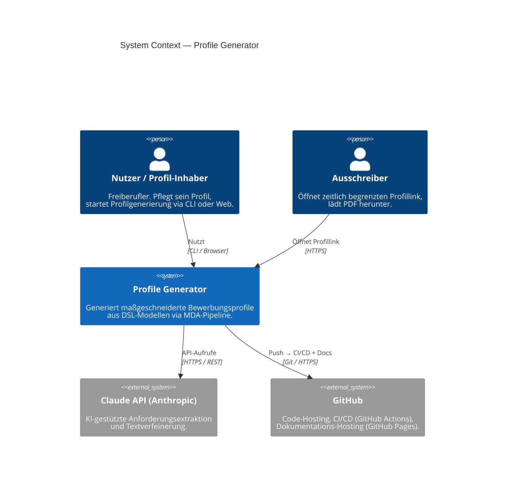

# 3. Kontextabgrenzung

## Fachlicher Kontext

Der Profile Generator steht zwischen dem Profil-Inhaber (Nutzer) und dem Ausschreiber. Der Nutzer pflegt sein Profil als DSL-Datei und startet die Generierung. Der Ausschreiber erhält einen zeitlich begrenzten Link und lädt das Profil herunter — ohne direkten Zugang zum System.

## C4 Level 1 — System Context

## Externe Schnittstellen

| System | Richtung | Protokoll | Zweck |
|---|---|---|---|
| **Claude API** | ausgehend | HTTPS/REST | Anforderungsextraktion aus Freitext, PSM-Textverfeinerung, Anschreiben-Generierung |
| **GitHub** | ausgehend | Git/HTTPS | Code-Versionierung, CI/CD (GitHub Actions), optionales Docs-Hosting |
| **Dateisystem** | bidirektional | lokale I/O | Lesen von `.profile`/`.req`, Schreiben von Ausgabedateien (Word, PDF, HTML) |
| **Microsoft Word** (COM) | ausgehend | Windows COM | PDF-Export via `docx2pdf` |
