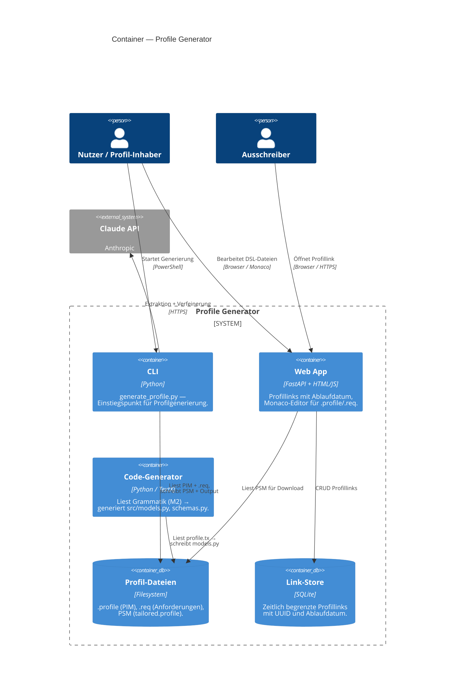
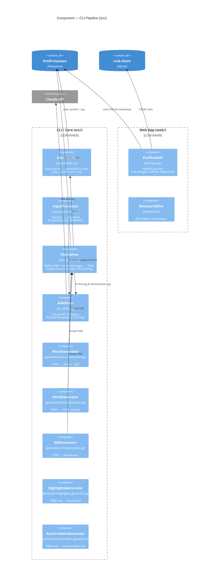

# 5. Bausteinsicht

## C4 Level 2 — Container

## C4 Level 3 — Component (CLI-Pipeline)

## Baustein-Beschreibungen

| Baustein | Datei | Verantwortung |
|---|---|---|
| `DataLoader` | `src/data_loader.py` | TextX-Parser → NetworkX-Graph. Einziger Einstiegspunkt für Modelldaten. |
| `InputProcessor` | `src/input_processor.py` | Freitext-Ausschreibung → valide `.req`-Datei via Claude API. |
| `PimToPsm` | `src/pim_to_psm.py` | M2M-Transformation: Graph-Traversierung + optionales KI-Scoring → PSM. |
| `AiRefiner` | `src/ai_refiner.py` | Zentraler Claude-API-Wrapper. Prompt-Caching, strukturierter Output, Langfuse-Observability. |
| `WordGenerator` | `src/generators/word_generator.py` | PSM → `.docx` (python-docx) + `.pdf` (docx2pdf). |
| `HtmlGenerator` | `src/generators/html_generator.py` | PSM → HTML via Jinja2-Template. |
| `HighlightsGenerator` | `src/generators/highlights_generator.py` | Top-Matches aus PSM-Scoring → einseitiges Kurzprofil. |
| `AnschreibenGenerator` | `src/generators/anschreiben_generator.py` | PSM + Anforderungen → Anschreiben via Claude API. |
| `ProfilinkAPI` | `web/app.py` | FastAPI: Link anlegen, öffnen, Download, Ablauf-Prüfung. |
| `codegen` | `codegen/codegen.py` | Liest `profile.tx` → generiert `src/models.py`, `src/graph_schema.py`, `web/schemas.py`. |

> **Invariante:** `src/models.py` und `src/graph_schema.py` werden ausschließlich von `codegen.py` geschrieben — nie manuell bearbeitet.
