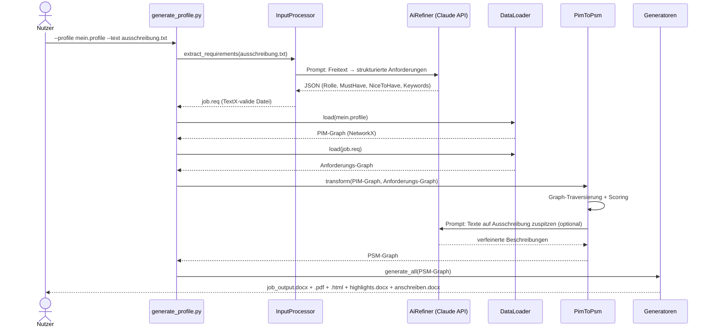
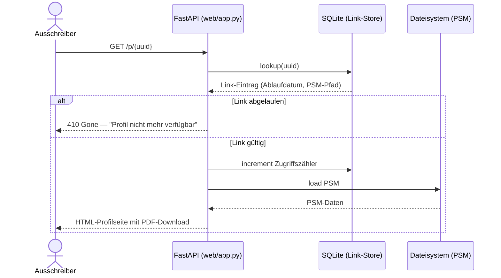
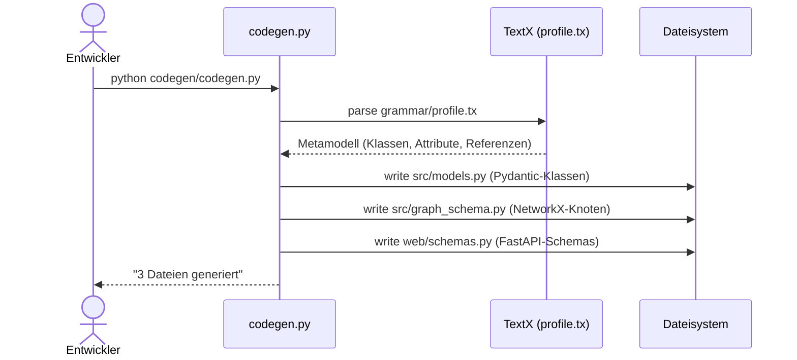

# 6. Laufzeitsicht

## Szenario 1: Profilgenerierung (Hauptpfad)

Der Nutzer hat eine Ausschreibung als Freitext und möchte ein maßgeschneidertes Profil erzeugen.

## Szenario 2: Ausschreiber öffnet Profillink

## Szenario 3: Code-Generierung (Entwicklerpfad)

